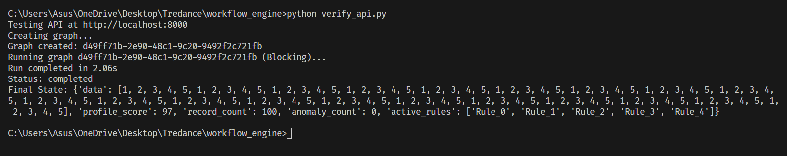

# Minimal Agent Workflow Engine

A lightweight, graph-based workflow engine for building agentic pipelines. Supports shared state, conditional branching, looping, asynchronous execution, and real-time log streaming via WebSockets.

## features
- **Graph-Based Execution**: Define workflows as nodes (tools) and edges (transitions).
- **Shared State**: Maintain context across steps.
- **Async Support**: Efficiently handle long-running operations.
- **WebSockets**: Stream execution logs in real-time.
- **Simple Tool Registry**: Easily plug in Python functions as tools.

## Installation

1.  **Clone the repository**
2.  **Install dependencies**:
    ```bash
    pip install -r requirements.txt
    ```

## Usage

### 1. Start the Server
Run the FastAPI server:
```bash
uvicorn main:app --reload
```


### 2. Verify Core Engine
Test the workflow logic directly (bypassing the API):
```bash
python verify_engine.py
```


### 3. Verify APIs (Blocking & Streaming)
Test the REST API and WebSocket streaming:

**Blocking API:**
```bash
python verify_api.py
```



**Streaming API:**
```bash
python verify_websocket.py
```


## API Reference

### Create Graph
- **POST** `/graph/create`
- Body: JSON graph definition (nodes, edges, start_node).

### Run Graph (Blocking)
- **POST** `/graph/run`
- Body: `{"graph_id": "...", "initial_state": {...}}`

### Stream Graph (WebSocket)
- **WS** `/graph/stream`
- Send: `{"graph_id": "...", "initial_state": {...}}`